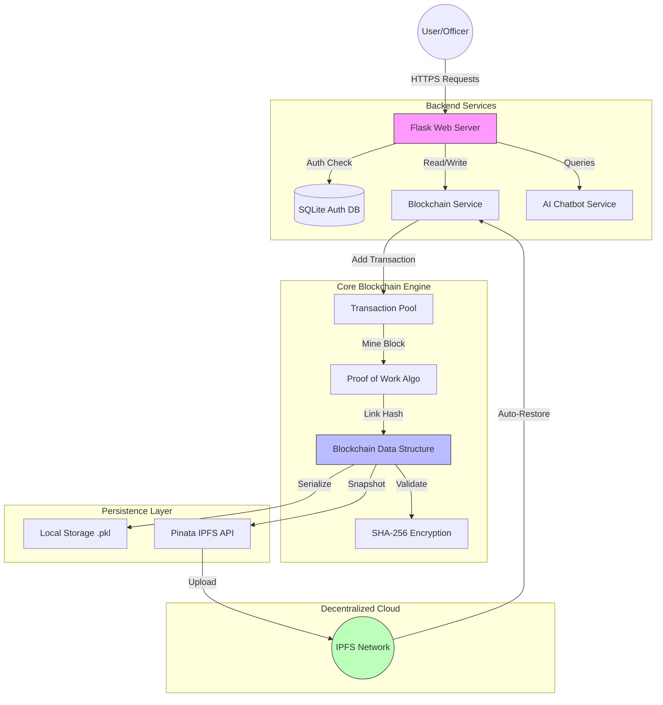

# Property Registration Blockchain System Documentation

## 1. Abstract
The real estate sector is plagued by property fraud, tampering of records, and lack of transparency, leading to costly disputes and erosion of public trust. This matters because secure property rights are fundamental to economic stability, yet traditional centralized databases remain vulnerable to insider manipulation and data corruption. **Our solution, PawParties**, is a secure, internal web application that utilizes a **custom-built, immutable blockchain** tailored to Indian identity standards (Aadhar, PAN) to ensure every property transaction is permanent and verifiable. Key technologies include **Python Flask, Custom Blockchain (POW), and IPFS (Pinata)** for decentralized, self-healing data persistence. This system is expected to eliminate record tampering, streamline officer workflows via AI assistance, and provide a fraud-proof lineage for property ownership without relying on expensive managed database infrastructure.

---

## 2. Problem Statement
**The Core Issue:**
Property registration systems in many regions are outdated, relying on physical files or centralized digital databases that are susceptible to unauthorized modification.

-   **Who is affected?** Property owners, government bodies, and legal entities who rely on accurate title deeds.
-   **Current Limitations:**
    -   **Mutability:** Admin users in standard databases can alter history (update/delete rows) without a trace.
    -   **Single Point of Failure:** Central servers are vulnerable to hardware failure, data corruption, or ransomware.
    -   **Lack of Transparency:** It is difficult for auditors to verify the complete history of a property’s ownership.
-   **Why existing solutions fail:** Standard SQL databases prioritize speed and mutability over integrity. They do not natively support "append-only" cryptographic guarantees required for a trustless registry.

---

## 3. Proposed Solution
**PawParties** is a blockchain-based property registry designed to bring trust and immutability to land records.
-   **Key Solution:** Instead of overwriting data when a property is transferred, our system creates a new, cryptographically linked "block" containing the transaction details. This builds an unalterable chain of custody.
-   **Key Features:**
    -   **Immutable History:** Once written, data cannot be changed.
    -   **Smart Identity Integration:** Natively validates Indian Aadhar and PAN formats.
    -   **Self-Healing Storage:** Automatically restores the entire blockchain from decentralized IPFS storage if the server acts up.
    -   **Role-Based Access:** Strict separation between Officers (registrars) and Admins (auditors).
-   **Innovation:** We combine the security of blockchain with the simplicity of a web app, removing the complexity of wallets/gas fees while retaining cryptographic integrity.

---

## 4. Tech Stack
-   **Backend Framework:** Python Flask 3.0.0
-   **Core Blockchain Logic:** Custom Python implementation (SHA-256 Hashing, Proof-of-Work)
-   **Frontend:** HTML5, CSS3, Jinja2 Templates (Responsive Dashboard)
-   **Database (Auth Only):** SQLite (for User Accounts & Sessions)
-   **Decentralized Storage:** IPFS via Pinata API (for Blockchain Data Backup)
-   **AI Assistance:** Custom Python Chatbot Service (Fuzzy Logic)

---

## 5. System Architecture
The system follows a hybrid architecture where authentication is handled by a relational DB, but all business data (properties) lives on the custom blockchain.

**Data Flow:**
1.  **User** submits a property request via the Web UI.
2.  **Flask** authenticates the user using SQLite.
3.  **Blockchain Service** processes the valid request, creating a new Block.
4.  **Proof of Work** is performed to secure the block.
5.  **Block** is appended to the chain locally.
6.  **Backup Service** pushes the updated chain state to **IPFS** and saves the CID for future restoration.

---

## 6. Modules & Features

### **User Module**
-   Handles secure login/logout and session management.
-   **Role Management:** Distinguishes between 'Officer' (Transaction Creator) and 'Admin' (System Auditor).

### **Operation Module (Officer)**
-   **Add Property:** Interface to register new land with Owner Name, Aadhar, Area, etc.
-   **Transfer Ownership:** Securely transfers title from User A to User B, verifying ownership history.
-   **Search & View:** Explore property lineage and current status.

### **Blockchain Module (Core)**
-   **Block Structure:** Index, Timestamp, Data (Transaction), Previous Hash, Current Hash, Nonce.
-   **Genesis Block:** Auto-created on system initialization.
-   **Mining Engine:** Solves cryptographic puzzles to validly add blocks.
-   **Validation Engine:** Iterates through the chain to detect tampering.

### **IPFS Backup Module**
-   **Auto-Backup:** Compresses and encrypts the blockchain state.
-   **Upload:** Sends data to Pinata (IPFS Provider).
-   **Auto-Restore:** On server restart, checks for a CID file and pulls the latest state from the decentralized network, ensuring zero data loss.

### **AI Chatbot Module**
-   Provides instant answers to officers regarding documentation, fees, and system usage.

---

## 7. Workflow / Use Case
**Scenario: Registering a New Property**

1.  **User Action:** Officer logs in and navigates to "Add Property". Enters details (Owner: "Ravi", Aadhar: "1234...", Survey No: "99").
2.  **Request Processing:** Backend verifies the Survey Number is unique and the active user is an Officer.
3.  **Block Creation:**
    -   System packages data into a "Block Candidate".
    -   Runs Proof-of-Work (finding a Nonce that results in a hash starting with '0000').
4.  **Chain Update:**
    -   Valid block is appended to the chain list.
    -   New block hash is linked to the previous block's hash.
5.  **Persistence (Local):** The chain is serialized and saved to `blockchain_data.pkl`.
6.  **Persistence (Cloud):** 
    -   `backup_to_ipfs()` is triggered.
    -   File is uploaded to Pinata.
    -   **CID (Content Identifier)** is returned and saved locally to `pinata_cid.txt`.
7.  **Completion:** User receives a distinct "Property ID" and "Block Hash" as a receipt.

---

## 8. Security & Privacy
-   **Cryptographic Linking:** Using SHA-256, every block contains the hash of the previous block. Changing one byte in Block #10 would invalidate Block #11, #12, and so on, making tampering immediately obvious.
-   **Immutable Ledger:** The system only supports *Adding* data. There is no `UPDATE` or `DELETE` function for blockchain records.
-   **Authentication:** Passwords are hashed (using werkzeug.security) before storage; raw passwords are never saved.
-   **Access Control:** Decorators (`@login_required`, `@admin_required`) ensure unauthorized users cannot trigger blockchain functions.

---

## 9. Innovation & Uniqueness
-   **Localized Standards:** Unlike generic templates, this system is specifically engineered for Indian localized data (Aadhar/PAN integration).
-   **Serverless Persistence:** The unique "Auto-Restore from IPFS" feature allows the application to be deployed on ephemeral containers (like Render.com free tier) without losing data, mimicking a "Serverless Database" using only the blockchain file and IPFS.
-   **Hybrid Architecture:** Combines the speed of a SQL relational DB for user auth with the security of a Blockchain for data storage.

---

## 10. Advantages & Limitations

**Advantages:**
-   **Tamper-Proof:** Mathematical guarantee of data integrity.
-   **Auditability:** A complete, unbroken history of every asset.
-   **Cost-Effective:** Uses free/cheap decentralized storage (IPFS) instead of expensive enterprise DBs.
-   **User-Friendly:** Complex crypto operations are hidden behind a clean Web UI.

**Limitations:**
-   **Scalability:** As the chain grows, validating the entire chain from the Genesis block on every startup can become slow (linear time complexity).
-   **Privacy:** In a pure public blockchain, data is visible to all. (Mitigated here by using an internal permissioned structure).
-   **Editability:** Genuine data entry errors cannot be "deleted", they must be corrected by a new "correction transaction", which leaves a permanent record of the mistake.

---

## 11. Future Enhancements
1.  **Smart Contracts:** Implement logic to automatically handle tax calculations or transfer fees.
2.  **Public Explorer:** allow citizens to view property status (read-only) without logging in.
3.  **Digital Signatures:** Integrate proper public/private key cryptography for officers to digitally sign blocks.
4.  **Distributed Nodes:** Expand from a single server to multiple nodes verifying transactions (Consensus).

---

## 12. Conclusion
The PawParties Property Registration System demonstrates a powerful application of blockchain technology beyond cryptocurrency. By securing land records with cryptographic immutability and leveraging decentralized storage for resilience, it offers a robust solution to the critical problem of property fraud. It bridges the gap between complex blockchain tech and practical government administration needs.

## 13. References
-   Nakamoto, S. (2008). Bitcoin: A Peer-to-Peer Electronic Cash System.
-   Flask Documentation (flask.palletsprojects.com)
-   IPFS Documentation (ipfs.tech)
-   Pinata API Reference (docs.pinata.cloud)
